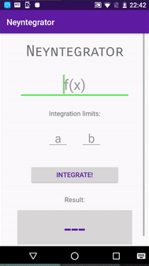

# Neyntegrator

* **Platform:** Android
* **API:** 24
* **Data Persistance:** None
* **Aplication Language:** English (UK)
* **Code Language:** Portuguese (BR)

Android app for calculating defined integrals by the Gauss-Legendre method for numerical integration. Using basicaly string substituition on Java, the app gets the value of the numerical integration for the given **f(x)**, **a** (lower limit) and **b** (upper limit).

Here is an example of how it works:

You can download the APK [here](https://drive.google.com/file/d/0Bxr3upEOcf-EZi1IblF4bVZzR2M/view?usp=sharing)
